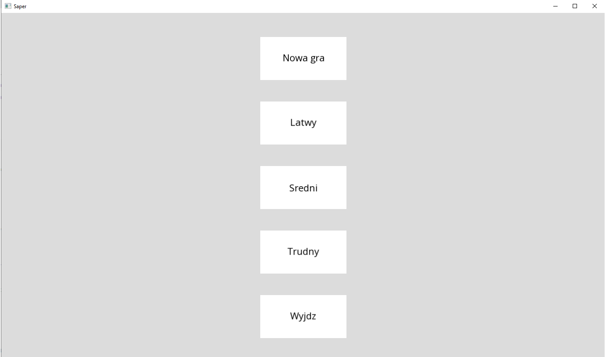
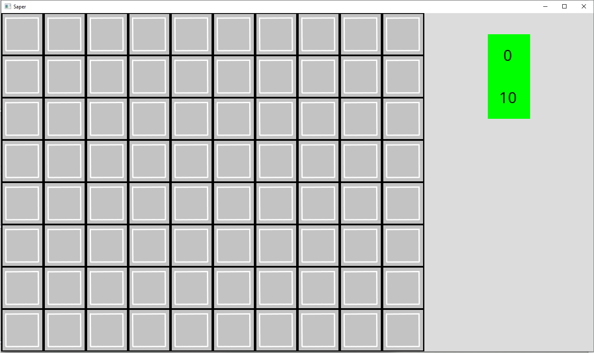
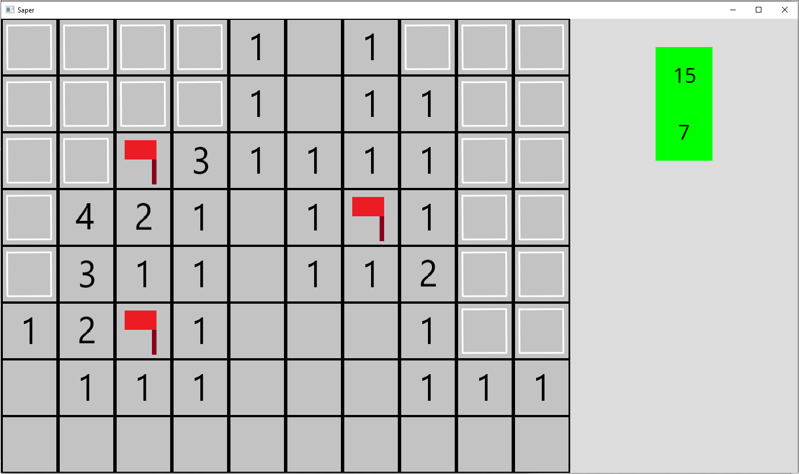
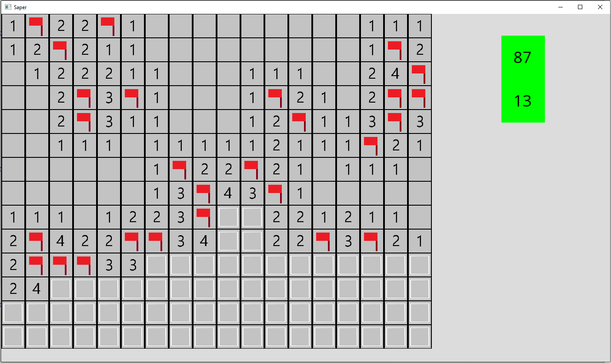
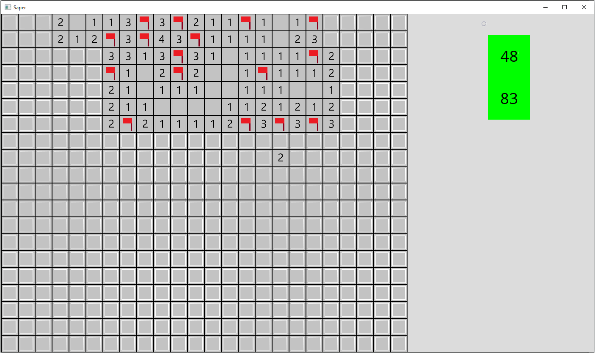
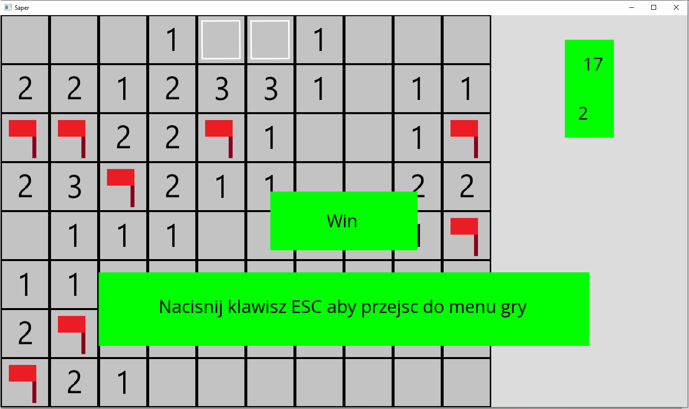
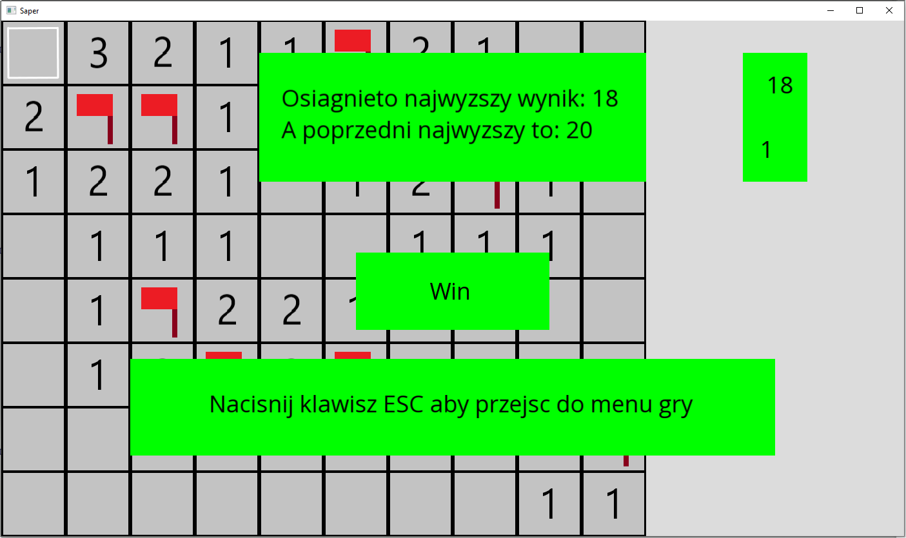
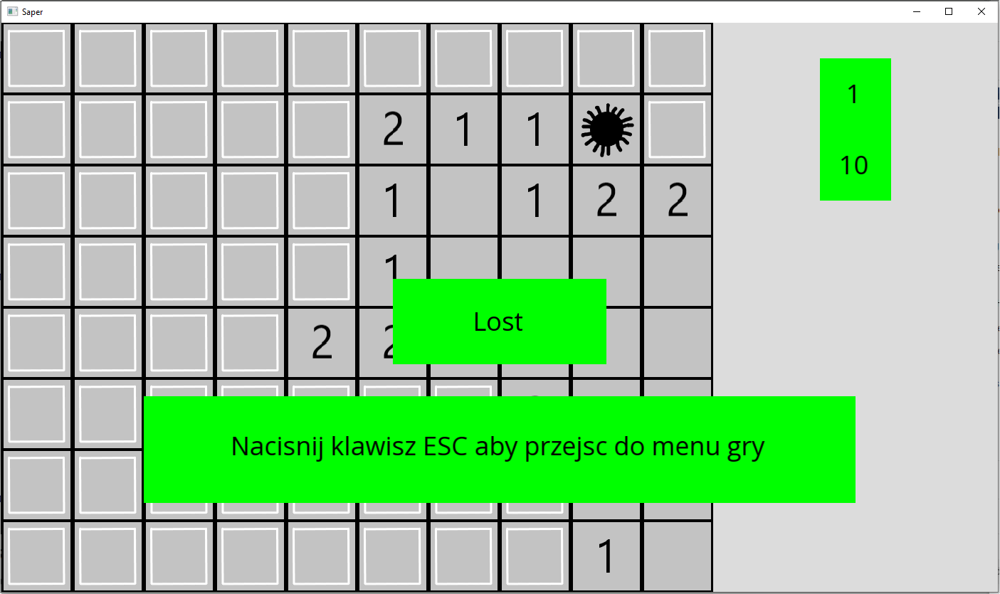

# Saper (08.2020)
Gra saper ze standardowymi funkcjami. Saper to popularna gra jednoosobowa polegająca na tym, że użytkownik (tak jak prawdziwy saper) musi rozminować całe pole o zadanej wielkości, ale dodatkowo jeszcze posiada informacje o całkowitej liczbie postawionych min. Na początku losowane są pozycje min, a następnie ustalane odpowiednie numery pól. Numerem pola jest liczba sąsiadujących min z tym polem np. jeśli dane pole sąsiaduje z 3 minami, wtenczas pole to będzie przyjmowało liczbę 3.

## Wymagania funkcjonalne:
* Wybór poziomu trudności (rozmiar planszy oraz liczba min),
* Przedwczesne zakończenie rozgrywki,
* Zmiana poziomu trudności,
* Stawianie flag,
* Odkrywanie pól poprzez kliknięcie w nieodkryte pole,
* Odkrywanie pól poprzez kliknięcie w odkryte pole,
* Licznik czasu gry,
* Licznik pozostałych flag do umieszczenia,
* Zapisywanie informacji o najlepszym czasie rozgrywki o danym poziomie trudności.

## Technologie:
* Główny język - C++,
* GUI - SFML (biblioteka graficzna języka C++).

## Szczegóły implementacyjne:

### Poziomy trudności:
* Łatwy - rozmiar planszy 8x10 oraz 10 min,
* Średni - rozmiar planszy 14x18 oraz 40 min,
* Trudny - rozmiar planszy 20x24 oraz 99 min.

### Stany gry
W celu bardziej intuicyjnej implementacji zastosowano stany gry: opcje oraz plansza. Każdy ze stanów posiada następny stan, który zostanie osiągnięty po zakończeniu aktualnego stanu.

### Okrywanie pól
Standardowym dodatkowym mechanizmem w odkrywaniu pól jest automatyczne odkrywanie sąsiednich pustych pól. Jeśli użytkownik kliknie w pole, które nie sąsiaduje z żadnymi minami (puste pole), wtenczas odkrywane są sąsiednie pola do momentu, aż na planszy nie będzie się znajdowało puste pole.

## Zrzuty ekranu:

Menu główne:

    

Wygląd pustej planszy:

    

`

Częściowo wypełniona łatwa plansza:

    

Częściowo wypełniona średnia plansza:

    

Częściowo wypełniona trudna plansza:

    

Wygrana:

    

Pobicie dotychczasowego rekordu:

    

Przegrana:

    

